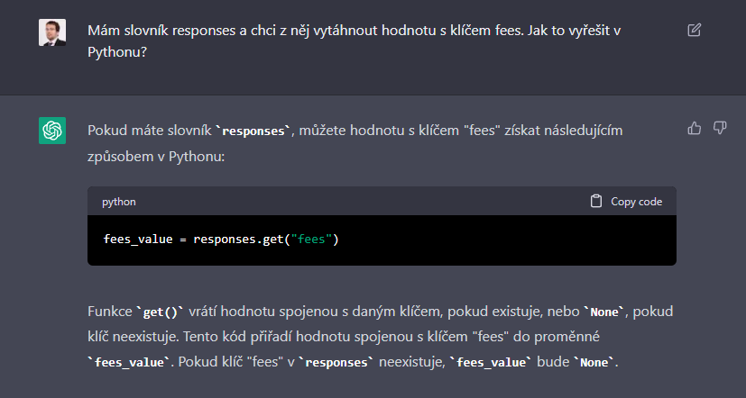
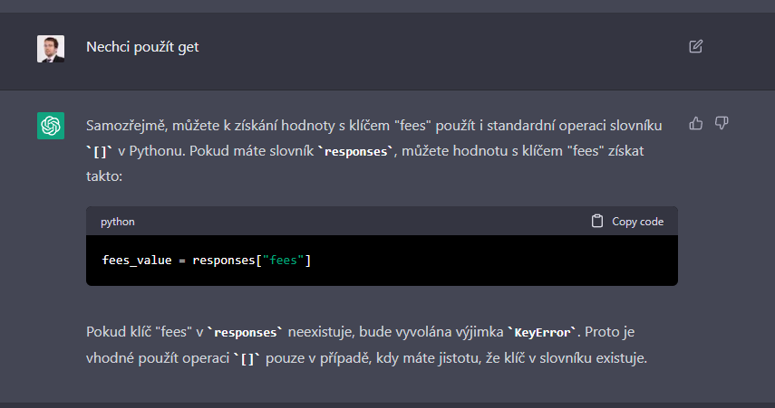

# Použití ChatGPT

Služba je k dispozici na adrese [https://chat.openai.com/](https://chat.openai.com/). Pro použití služby je potřeba se zaregistrovat.

Poté se zobrazí aplikace, která má v podstatě jen jeden ovládací prvek - okénko pro zadání vstupu. Do něj můžeme zapsat dotaz (umí celkem dobře i česky).

Zde se ptáme, jak zjistit hodnotu ze slovníku podle vybraného klíče (ukazovali jsme si to na lekci, ale zapomněli jsme to a chceme si to připomenout). ChatGPT nám nabízí použití metody `.get()`, kterou jsme si na lekci zatím neukazovali.

Můžeme tedy ChatGPT požádat, aby funkci nepoužil. ChatGPT nám nyní ukáže postup s hranatými závorkami, který známe z lekce.

