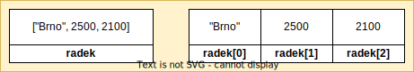

# Použití cyklu pro dvourozměrný seznam

Máme tabulku s prodejem učebnic chemie v několika městech České republiky.

| Město    | Prodané kusy v roce 2021 | Prodané kusy v roce 2022 |
| -------- | ----------------------------- | ---------------------------- |
| Praha    | 4200                       | 4900                      |
| Brno     | 2500                       | 2100                      |
| Ostrava  | 1500                       | 1100                      |
| Plzeň    | 1000                       | 700                       |
| Liberec  | 700                        | 500                       |
| Olomouc  | 400                        | 300                       |

Data máme zadaná v Pythonu jako dvourozměrný seznam. Naším úkolem je zjistit, ve kterých městech prodeje učebnice poklesly.

```py
prodej_knih = [
    ["Praha", 4200, 4900],
    ["Brno", 2500, 2100],
    ["Ostrava", 1500, 1100],
    ["Plzeň", 1000, 700],
    ["Liberec", 700, 500],
    ["Olomouc", 400, 300]
]
```

## Řešení úlohy v SQL

Uvažujme, jak bychom řešili příklad v SQL. Tento příklad je založený na tom, že říkáme, jaký by měl být výsledek. Jinak řečeno, říkáme, *co chceme*. Neříkáme, jakým způsobem by měl počítač k požadovanému výsledku dojít.

```sql
SELECT mesto
FROM prodej_knih
WHERE rok2 < rok1;
```

## Řešení úlohy v Pythonu

V Pythonu s využitím cyklu říkáme, co má počítač udělat, tj. dáváme mu posloupnost kroků, kterou má provést, aby dospěl k námi požadovanému výsledku. Instrukce, které počítači dáme, jsou následující:

1. Projdi jednotlivé prvky seznamu (projdi tabulku řádek po řádku).
1. Pro každý prvek (podseznam) se podívej, jestli je hodnota ta pozici 1 větší než hodnota na pozici 2.
1. Pokud ano, vypiš prvek na pozici 0.


```py
# Projdi tabulku prodej knih řádek po řádku
for radek in prodej_knih:
    # Podívej se, jestli je hodnota na  pozici 1 větší než hodnota na pozici 2
    if radek[1] > radek[2]:
        # Pokud ano, vypiš na oprazovku hodnotu na pozici 0
        print(radek[0])
```

### První opakování cyklku

Python do proměnné `radek` vloží to, co je na začátku seznamu, tj. prodeje v Praze. To, že jde o proměnnou `radek`, určíme tím, že název `radek` vložíme mezi `for` a `in`.

```py
for radek in prodej_knih:
```


Nyní je vyhodnocená podmínka

```py
    if radek[1] > radek[2]:
```


Hodnota `radek[1]` je 4200 a hodnota `radek[2]` je 4900. Není tedy pravda, že je hodnota `radek[1]` větší než hodnota na pozici `radek[2]`, proto nespouštíme kód uvnitř podmínky. V cyklu již další příkazy nejsou a pokračuje dál.


### Druhé opakování cyklu

Python vidí, že není na konci seznamu, a proto tedy spouští cyklus znovu. Do proměnné `radek` vloží to, co je na dalším místě, tj. prodeje v Brně.


Nyní je vyhodnocená podmínka

```py
    if radek[1] > radek[2]:
```



Hodnota `radek[1]` je 2500 a hodnota `radek[2]` je 2100. V tomto případě je pravda, že hodnota `radek[1]` je větší než `radek[2]`. To znamená, že prodeje skutečně poklesly.

Python nyní spouští příkaz, který je uvnitř podmínky.

```py
        print(radek[0])
```

Hodnota `radek[0]` se nyní zobrazí na obrazovce.

### Třetí opakování cyklu

Třetí opakování cyklu se týká Ostravy.


I zde bude podmínka vyhodnocena jako pravda a Python vypíše i "Ostrava".


### Čtvrté opakování cyklu

Další pokračování se týká Plzně.


Prodeje poklesly i zde.


### Páté opakování cyklu

V Liberci prodeje taktéž klesly.


### Šesté opakování cyklu

A v Olomouci též prodeje taktéž klesly.


### Použití krokování

Podobné schéma si můžeme zobrazit ve Visual Studio Code v postupu označeném jako krokování (debuggování). Krokování je podobné například prohlížení si zpomalených záběrů při hokeji. Na zpomaleném záběru je lépe vidět, jak se jednotliví hráči a puk pohybovali. U krokování program zastavíme a poté spuštíme dál po jednotlivých krocích (snímcích). Můžeme se též podívat na aktuálně existující proměnné a jejich hodnoty.

Nejprve je nutné umístit break-point, tj. bod, ve kterém se program (video) zastaví.


Poté klikneme na ikonku Run and Debug v levém menu a poté na tlačítko Run and Debug, které se nám zobrazí.


Pokud program krokujeme poprvé, musíme vybrat jeho typ. V našem případě volíme Python File.


Program se zastaví na začátku cyklu, tj. v break-pointu. Zatím máme pouze proměnnou `prodej_knih`. Posuneme se tedy o jeden krok (snímek) dopředu.


Posunutí vpřed provedeme pomocí ikonky šipky s tečkoku (druhá zleva). Pozor na použití správné ikonky! První ikonka pustí program dál až do dalšího break-pointu, případně program doběhne až do konce!


Nyní jsme o krok (snímek) dál a vidíme, že vznikla proměnná `radek`. Protože proměnná je seznam, můžeme ji rozkliknout a vidíme hodnoty ja jednotlivých pozicích.

Aktuální pozici nám vyznačuje podbarvení řádku a šipka vlevo u čísla řádku.


Visual Studio Code nám tedy zobrazuje stejné informace, které byly na schématu, pouze v graficky jiné podobě.


Podíváme se o dva kroky dále (všimni si, že řádek uvnitř podmínky se nepodtrhne - protože je podmínka nesplněná, Python se řádku uvnitř podmínky vyhne). O dva kroky dále již vidíme čísla pro Brno. Visual Studio v levém panelu zvýrazní, které hodnoty se mezi kroky změnily, což pomáhá v případě, kdy je proměnných hodně.


V případě Brna už se podíváme i do vnitřku podmínky, protože výraz v podmínce je vyhodnocen jako pravda.


